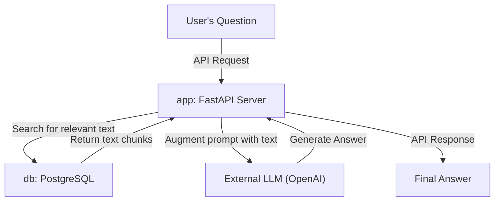

# LegalQA: Advanced RAG for Hungarian Legal Documents

[](https://opensource.org/licenses/MIT)

An advanced, Retrieval-Augmented Generation (RAG) system designed to answer complex legal questions based on a corpus of Hungarian court decisions. This project is containerized using Docker and managed with Docker Compose for robust and reproducible deployment.

## Architecture

The system utilizes a multi-container Docker setup orchestrated by `docker-compose.yml`:

- **`app` service:** A FastAPI application that serves the QA model, handles API requests, and contains all the core logic for the RAG pipeline.
- **`db` service:** A PostgreSQL database to store document chunks efficiently.



## Prerequisites

- [Docker](https://www.docker.com/get-started) and [Docker Compose](https://docs.docker.com/compose/install/)
- `make` command-line tool.
- An OpenAI API key.

## Installation

1.  **Clone the repository:**
    ```sh
    git clone https://github.com/your-username/LegalQA_v2.git
    cd LegalQA_v2
    ```

2.  **Create the environment file:**
    -   Create a `.env` file in the project root by copying and filling out the example below. This file will store your API key and other configuration variables.
    -   **Important:** This file is listed in `.gitignore` and will not be committed to version control.

    ```env
    # --- API Keys ---
    # Replace with your actual OpenAI API key
    OPENAI_API_KEY="sk-..."

    # --- Database Configuration for Docker Compose ---
    # The 'app' service will use these to connect to the 'db' service.
    # 'POSTGRES_HOST' MUST be the service name ('db') for container networking.
    POSTGRES_USER=admin
    POSTGRES_PASSWORD=admin
    POSTGRES_DB=legalqa
    POSTGRES_HOST=db
    POSTGRES_PORT=5432
    
    # --- Data File Configuration ---
    # The name of the main parquet file located in the ./data directory
    PARQUET_FILENAME=all_data.parquet
    ```

3.  **Place the data file:**
    -   Place your main Parquet data file (e.g., `all_data.parquet`) into the `data/` directory.
    -   The filename must match the `PARQUET_FILENAME` variable in your `.env` file.

## Usage: Development vs. Production

The project is designed with two distinct environments managed by the `Makefile`.

---

### 1. Development Environment (Recommended for Local Use)

The development environment is designed for speed and convenience. It works with a small, randomly generated sample of your data, allowing the services to start quickly and enabling live-reloading for code changes.

1.  **Create the sample data:**
    -   This command runs a script that creates a small `sample_data.parquet` file from your main data file.
    ```sh
    make setup-dev
    ```

2.  **Build the database and start the services:**
    -   This command will:
        -   Build the database using **only the sample data**.
        -   Start the `app` and `db` services using `docker-compose.override.yml`.
        -   Enable live-reloading for the `app` service. Any changes you make in the `src/` directory will automatically restart the server.
    ```sh
    make dev
    ```

3.  **Access the API:**
    -   The API is now available at `http://localhost:8000`.
    -   Interactive documentation (Swagger UI) is at `http://localhost:8000/docs`.

---

### 2. Production Environment (For Deployment)

The production environment is intended for deployment on a server with sufficient resources. It uses the entire dataset and runs the services in a detached, optimized mode.

**Warning:** Building the full database is a resource-intensive process and may take a very long time depending on your data size and machine performance.

1.  **Build the production database:**
    -   This command populates the PostgreSQL database with the **entire dataset** from your `all_data.parquet` file.
    ```sh
    make setup-prod
    ```

2.  **Start the services in production mode:**
    -   This command starts the `app` and `db` services in the background.
    ```sh
    make prod
    ```

3.  **Interact with the API:**
    -   The API is available at `http://localhost:8000` (or your server's address).
    -   **Example `curl` request:**
        ```sh
        curl -X POST "http://localhost:8000/ask" \
             -H "Content-Type: application/json" \
             -d '{"question": "Mi a bűnszervezet fogalma a Btk. szerint?"}'
        ```
---

### Managing the Services

The `Makefile` provides simple commands to manage the Docker containers.

-   **Stop all services:**
    ```sh
    make stop
    ```
    *(This stops the containers started by either `make dev` or `make prod`.)*

-   **Clean up the environment:**
    -   This command stops the containers and removes all associated volumes (including the database data) and networks. Use with caution.
    ```sh
    make clean
    ```

## Data Schema

To use your own data, you must provide a Parquet file with the following columns:

-   `chunk_id`: A unique identifier for each text chunk.
-   `doc_id`: A unique identifier for the parent document.
-   `text`: The text content of the chunk.
-   `embedding`: The vector embedding of the `text`.

---

## License

Distributed under the MIT License. See `LICENSE` for more information.
