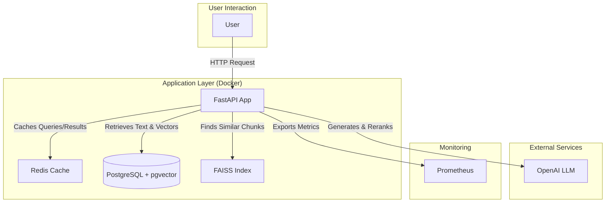

# LegalQA: High-Performance RAG System for Legal Documents

[](https://opensource.org/licenses/MIT)

LegalQA is a production-ready, high-performance Retrieval-Augmented Generation (RAG) system designed to answer complex legal questions based on a large corpus of documents. It is built with a modern, scalable architecture, fully containerized with Docker, and ready for deployment.

## 🏗️ Architecture

The system is designed for performance and scalability, leveraging asynchronous processing, multi-level caching, and a robust database backend.



## ✨ Key Features

- **High-Performance API**: Built with **FastAPI** for asynchronous, high-throughput request handling.
- **Multi-Level Caching**: In-memory and **Redis** cache for rapid responses to repeated queries and reduced API costs.
- **Efficient Document Retrieval**: A combination of **FAISS** for fast vector similarity search and a **PostgreSQL** database (with `pgvector`) for storing and retrieving text chunks.
- **Advanced Reranking**: Utilizes a secondary LLM call to rerank retrieved documents, significantly improving the relevance of the context provided to the final generation model.
- **Containerized & Reproducible**: Fully containerized with **Docker** and managed with **Docker Compose** for consistent development and production environments.
- **Performance Monitoring**: Integrated **Prometheus** endpoint (`/metrics`) for real-time monitoring of application performance, request latency, and cache hit rates.

## 🚀 Getting Started

### Prerequisites

- [Docker](https://www.docker.com/get-started) & [Docker Compose](https://docs.docker.com/compose/install/)
- An OpenAI API key
- `make` command-line utility (optional, but recommended)

### Installation

1.  **Clone the Repository**
    ```sh
    git clone https://github.com/ZeleMate/LegalQA_v2.git
    cd LegalQA_v2
    ```

2.  **Configure Environment**
    Create a `.env` file in the project root. You can copy the structure from the example below. This file stores your API keys and other configuration variables. **It is ignored by Git.**

    ```env
    # --- API Keys ---
    OPENAI_API_KEY="sk-..."

    # --- Database Configuration ---
    # These are used by the app to connect to the 'db' service inside Docker.
    # The POSTGRES_HOST must be the service name ('db').
    POSTGRES_USER=admin
    POSTGRES_PASSWORD=admin
    POSTGRES_DB=legalqa
    POSTGRES_HOST=db
    POSTGRES_PORT=5432

    # --- Redis Configuration ---
    REDIS_HOST=redis
    REDIS_PORT=6379
    
    # --- Data File Configuration ---
    # The name of your main parquet file located in the ./data directory
    PARQUET_FILENAME=all_data.parquet
    ```

3.  **Place Your Data**
    -   Place your Parquet data file (e.g., `all_data.parquet`) into the `data/` directory.
    -   The filename must match `PARQUET_FILENAME` in your `.env` file.
    -   Ensure your data conforms to the schema described in the [Data Schema](#-data-schema) section.

## Usage

The `Makefile` provides convenient commands for managing the application lifecycle for both development and production.

### Development Environment

The development environment uses a small sample of your data for a fast startup and enables hot-reloading for code changes.

1.  **Setup Development Data & Services:**
    This command creates a sample dataset, builds a local FAISS index, and starts the services.
    ```sh
    make dev-setup
    ```

2.  **Access the API:**
    The API will be available at `http://localhost:8000`. The interactive Swagger UI documentation can be found at `http://localhost:8000/docs`.

3.  **Stop the Development Environment:**
    ```sh
    make dev-down
    ```

### Production Environment

The production environment uses the entire dataset and is optimized for performance.

1.  **Build and Setup Production:**
    This command builds the production Docker images and populates the database with the full dataset.
    ```sh
    make prod-setup
    ```

2.  **Start Production Services:**
    ```sh
    make prod-up
    ```

3.  **Stop the Production Environment:**
    ```sh
    make prod-down
    ```

### Clean Up

To stop all containers and remove all associated volumes (including database data), run:
```sh
make clean
```

## API Endpoints

-   `POST /ask`: The main endpoint for asking questions.
-   `GET /health`: A detailed health check that reports the status of the application, database, and cache.
-   `GET /stats`: Provides real-time performance statistics.
-   `GET /metrics`: Exposes performance metrics in a format compatible with Prometheus.
-   `POST /clear-cache`: Clears the Redis cache.

**Example `curl` Request:**
```sh
curl -X POST "http://localhost:8000/ask" \
     -H "Content-Type: application/json" \
     -d '{
       "question": "Milyen ítéleteket hozott a Kúria 2024-ben?",
       "use_cache": true
     }'
```

## 🧪 Testing

The project includes a comprehensive test suite. To run all tests:

1.  Install development dependencies:
    ```sh
    make install
    ```
2.  Run the tests:
    ```sh
    make test
    ```

You can also run specific test types (e.g., `make test-functionality`, `make test-performance`) or lint the code (`make lint`).

## 📋 Data Schema

To use your own data, you must provide a Parquet file with the following columns:

-   `chunk_id` (string): A unique identifier for each text chunk.
-   `doc_id` (string): A unique identifier for the parent document.
-   `text` (string): The text content of the chunk.
-   `embedding` (binary/vector): The vector embedding of the `text`.

---

## 📄 License

This project is distributed under the MIT License. See `LICENSE` for more information.
