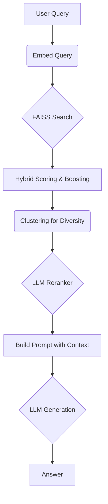

# LegalQA: Advanced RAG for Hungarian Legal Documents

[](https://opensource.org/licenses/MIT)

An advanced, Retrieval-Augmented Generation (RAG) system designed to answer complex legal questions based on a corpus of Hungarian court decisions.

> **Note:** This project is currently under active development. The core RAG pipeline is functional, but features like testing, CI/CD, and containerization are planned for the future as outlined in the Roadmap.

## About The Project

LegalQA is engineered for legal professionals, researchers, and students who require precise, context-aware answers from a large database of legal precedents. It moves beyond simple semantic search by implementing a sophisticated, multi-stage pipeline to ensure the highest relevance, authority, and diversity in the documents provided to the language model.

## Key Features

- **Hybrid Search:** Combines FAISS vector search with traditional cosine similarity for a more robust initial retrieval score.
- **Metadata Boosting:** Dynamically boosts the relevance of documents based on key metadata, such as the issuing court (e.g., Kúria) and the recency of the decision.
- **Contextual Reranking:** Utilizes a second, specialized LLM (`gpt-4o-mini`) to rerank the retrieved documents based on their direct legal relevance to the user's query, ensuring the most pertinent information is prioritized.
- **Result Diversification:** Implements k-means clustering on document embeddings to group similar results and selects the most relevant cluster, preventing redundancy and providing a broader context for the answer.
- **Dual-Interface:** Offers both a command-line interface (CLI) for interactive querying and a FastAPI-powered REST API for programmatic integration.
- **Traceable Reasoning:** The final answer is generated by a powerful LLM (`gpt-4.1`) instructed to base its reasoning strictly on the provided source documents.

## Architecture

The system follows a multi-stage pipeline to process a user's query and generate a well-founded answer.



## Getting Started

Follow these steps to set up the project locally.

### Prerequisites

- Python 3.10+
- Pip and a virtual environment tool (`venv`)

### Installation

1.  **Clone the repository:**
    ```sh
    git clone https://github.com/your-username/LegalQA_v2.git
    cd LegalQA_v2
    ```

2.  **Create and activate a virtual environment:**
    ```sh
    python -m venv venv
    source venv/bin/activate
    # On Windows, use: venv\Scripts\activate
    ```

3.  **Install the required dependencies:**
    ```sh
    pip install -r requirements.txt
    ```

4.  **Set up environment variables:**
    -   Create a `.env` file in the project root by copying the example template:
        ```sh
        cp .env.example .env
        ```
    -   Open the `.env` file and add your secret keys and file paths.
        ```
        OPENAI_API_KEY=your_openai_api_key_here
        PARQUET_PATH=/path/to/your/data.parquet
        FAISS_INDEX_PATH=/path/to/your/index.faiss
        ID_MAPPING_PATH=/path/to/your/id_mapping.pkl
        ```

## Usage

You can interact with LegalQA through a CLI or a REST API.

### 1. Command-Line Interface (CLI)

To start an interactive chat session, run the `main.py` script:

```sh
python scripts/main.py
```

You will be prompted to enter your questions. Type `exit` or `quit` to end the session.

### 2. REST API

The project includes a FastAPI application for programmatic access.

1.  **Start the server:**
    Use `uvicorn` to launch the API. It's recommended to run it from the project's root directory.
    ```sh
    uvicorn src.inference.app:app --reload --port 8000
    ```

2.  **Send a request:**
    You can now send `POST` requests to the `/ask` endpoint.

    **Example using `curl`:**
    ```sh
    curl -X POST "http://127.0.0.1:8000/ask" \
         -H "Content-Type: application/json" \
         -d '{"question": "Mi a bűnszervezet fogalma a Btk. szerint?"}'
    ```

    The API will return a JSON object containing the answer and the source document IDs.

## Data Schema

To use your own data with this project, you will need to generate the following files:

1.  **Parquet File (`data.parquet`):** A Pandas DataFrame saved in Parquet format containing the documents and their metadata. It must include the following columns at a minimum:
    -   `doc_id`: A unique identifier for each document.
    -   `text`: The full text content of the document.
    -   `embedding`: The vector embedding of the `text`.
    -   Additional metadata columns used for boosting (e.g., `HatarozatEve`, `MeghozoBirosag`).

2.  **FAISS Index (`index.faiss`):** A FAISS index built from the `embedding` column of your Parquet file.

3.  **ID Mapping (`id_mapping.pkl`):** A Python pickle file containing a dictionary that maps the internal FAISS index IDs to your custom `doc_id` values.

## Roadmap

This project is under active development. Future plans include:

-   [ ] **Containerization:** Create a `Dockerfile` and `docker-compose.yml` for easy deployment.
-   [ ] **Cloud Deployment:** Develop configuration and guides for deploying on cloud platforms like Azure.
-   [ ] **CI/CD:** Set up GitHub Actions for automated testing and linting.
-   [ ] **Testing & Evaluation:** Implement a comprehensive suite of unit tests and an evaluation pipeline for the RAG system.
-   [ ] **Frontend Interface:** Develop a simple and intuitive web interface for easier interaction.
-   [ ] **Graph-based Retrieval:** Integrate the existing graph data (`graph.graphml`) to leverage relationships between legal cases and enhance retrieval relevance.
-   [ ] **Advanced Retrieval Strategies:** Experiment with emerging techniques like agentic retrieval to further improve performance.

## License

Distributed under the MIT License. See `LICENSE` for more information.
