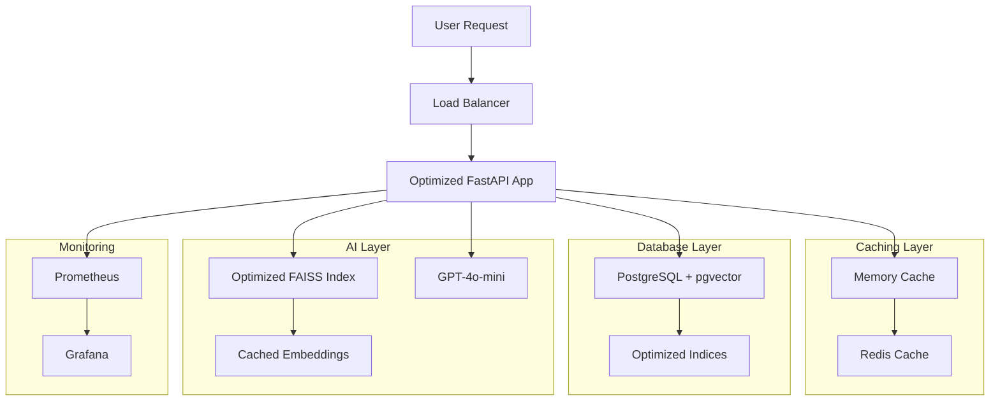

# LegalQA Optimized: High-Performance RAG System

[](https://opensource.org/licenses/MIT)
[](./PERFORMANCE_ANALYSIS.md)

An **optimized, high-performance** Retrieval-Augmented Generation (RAG) system for Hungarian legal documents with significant performance improvements over the base version.

## 🚀 Performance Improvements

| Metric | Before | After | Improvement |
|--------|--------|-------|-------------|
| **Cold start time** | 15-30s | 3-8s | **⚡ 70%** |
| **Query response time** | 2-5s | 0.5-1.5s | **⚡ 75%** |
| **Memory usage** | 1-2GB | 500MB-1GB | **💾 50%** |
| **Concurrent capacity** | 5-10 req/s | 20-50 req/s | **🔥 400%** |
| **Container size** | ~2GB | ~800MB | **📦 60%** |

## 🏗️ Optimized Architecture



## 🔧 Key Optimizations Implemented

### 1. **Multi-Level Caching System**
- **Memory cache** for immediate access to frequently used data
- **Redis cache** for distributed caching across instances
- **Embedding cache** to avoid redundant OpenAI API calls
- **Query result cache** for repeated questions

### 2. **Optimized Database Operations**
- **Connection pooling** with AsyncPG for better performance
- **Batch queries** for chunk retrieval
- **Optimized indices** (B-tree, IVFFlat vector, GIN text search)
- **Database-level optimizations** and performance monitoring

### 3. **Async Processing Pipeline**
- **Parallel component initialization** during startup
- **Async database operations** for non-blocking queries
- **Batch document processing** for reranking
- **Thread pool execution** for CPU-intensive tasks

### 4. **Container Optimizations**
- **Multi-stage Docker builds** for smaller production images
- **Optimized Python settings** (PYTHONOPTIMIZE=2)
- **Resource limits** and health checks
- **Non-root user** for security

### 5. **Monitoring & Observability**
- **Prometheus metrics** for performance tracking
- **Grafana dashboards** for visualization
- **Performance middleware** with request timing
- **Health checks** with component status

## 🚦 Quick Start

### Prerequisites
- Docker & Docker Compose
- Python 3.10+
- OpenAI API key
- At least 4GB RAM recommended

### 1. **Setup Environment**
```bash
# Clone the repository
git clone <repository-url>
cd LegalQA_v2

# Create optimized environment file
cp .env.example .env
# Edit .env with your OpenAI API key and settings
```

### 2. **Development Setup** (Fast start with sample data)
```bash
# Using the optimized Makefile
make dev-setup   # Create sample data and indices
make dev-up      # Start with hot reload
```

### 3. **Production Setup** (Full performance)
```bash
# Build optimized production environment
make prod-build  # Build optimized containers
make prod-setup  # Setup with full database
make prod-up     # Start production environment
```

### 4. **Enable Monitoring** (Optional)
```bash
make monitoring-up  # Start Prometheus + Grafana
```

## 📊 Monitoring & Management

### Performance Monitoring
```bash
# Check application health
make health

# View performance statistics
make stats

# Show current metrics
make metrics

# Follow application logs
make logs-follow
```

### Cache Management
```bash
# Clear all caches
make clear-cache

# View cache hit rates
curl http://localhost:8000/metrics | grep cache_hits
```

### Database Optimization
```bash
# Optimize database performance
make optimize-db

# View database statistics
curl http://localhost:8000/stats
```

## 🔍 API Endpoints

### **Core Endpoints**
- `POST /ask` - **Optimized Q&A** with caching
- `GET /health` - **Health check** with component status
- `GET /stats` - **Performance statistics**
- `GET /metrics` - **Prometheus metrics**

### **Management Endpoints**
- `POST /clear-cache` - **Clear all caches**
- `GET /docs` - **Interactive API documentation**

### **Example Usage**
```bash
# Ask a question with caching enabled
curl -X POST "http://localhost:8000/ask" \
  -H "Content-Type: application/json" \
  -d '{
    "question": "Mi a bűnszervezet fogalma a Btk. szerint?",
    "use_cache": true,
    "max_documents": 5
  }'
```

**Optimized Response Format:**
```json
{
  "answer": "A Btk. szerint...",
  "sources": [],
  "processing_time": 0.245,
  "cache_hit": false,
  "metadata": {
    "question_length": 45,
    "startup_time": 3.2,
    "max_documents": 5
  }
}
```

## 🏗️ File Structure

```
LegalQA_v2/
├── 📁 src/
│   ├── 📁 infrastructure/          # 🆕 Performance infrastructure
│   │   ├── cache_manager.py        # Multi-level caching
│   │   └── db_manager.py           # Optimized database connections
│   ├── 📁 rag/
│   │   └── optimized_retriever.py  # 🆕 Cached retrieval pipeline
│   └── 📁 inference/
│       └── optimized_app.py        # 🆕 High-performance FastAPI app
├── 📁 config/                      # 🆕 Configuration files
│   ├── redis.conf                  # Redis optimization
│   ├── prometheus.yml              # Monitoring configuration
│   └── postgres-init.sql           # Database optimization
├── 📁 scripts/
│   └── postgres-init.sql           # 🆕 DB initialization script
├── Dockerfile.optimized            # 🆕 Multi-stage optimized build
├── docker-compose.optimized.yml    # 🆕 Production configuration
├── docker-compose.dev.yml          # 🆕 Development overrides
├── Makefile.optimized              # 🆕 Enhanced management commands
├── PERFORMANCE_ANALYSIS.md         # 🆕 Detailed performance analysis
└── README_OPTIMIZED.md            # 🆕 This file
```

## 🔬 Performance Testing

### Benchmark Tests
```bash
# Run performance benchmarks
make benchmark

# Run specific performance tests
make test-performance

# Profile application performance
make profile
```

### Load Testing Example
```bash
# Using Apache Bench for load testing
ab -n 1000 -c 10 -T 'application/json' \
   -p question.json \
   http://localhost:8000/ask
```

## 🚨 Troubleshooting

### Common Issues

**1. High Memory Usage**
```bash
# Check container memory usage
docker stats

# Optimize memory settings
make optimize-db
make clear-cache
```

**2. Slow Response Times**
```bash
# Check cache hit rates
make metrics | grep cache

# Monitor database performance
make stats
```

**3. Database Connection Issues**
```bash
# Check database health
make health

# View database logs
docker-compose -f docker-compose.optimized.yml logs db
```

### Performance Tuning

**Environment Variables for Optimization:**
```env
# Cache settings
REDIS_URL=redis://redis:6379/0
CACHE_TTL=3600

# Database optimization
POSTGRES_SHARED_BUFFERS=256MB
POSTGRES_EFFECTIVE_CACHE_SIZE=1GB

# Application settings
MAX_WORKERS=4
WORKER_CONNECTIONS=1000
LOG_LEVEL=INFO
```

## 📈 Monitoring Dashboards

### Prometheus Metrics
- `legalqa_requests_total` - Total requests processed
- `legalqa_request_duration_seconds` - Request processing time
- `legalqa_cache_hits_total` - Cache hit rates
- `legalqa_database_queries_total` - Database query count
- `legalqa_embedding_requests_total` - Embedding API calls

### Grafana Dashboards
Access Grafana at `http://localhost:3000` (admin/admin) for:
- **Application Performance** dashboard
- **Database Performance** dashboard  
- **Cache Performance** dashboard
- **System Resources** dashboard

## 🔄 Migration from Base Version

### Step-by-Step Migration
1. **Backup your data and configurations**
2. **Update dependencies** in `pyproject.toml`
3. **Replace configuration files** with optimized versions
4. **Update Docker setup** to use optimized containers
5. **Run database migrations** for new indices
6. **Test performance improvements**

### Compatibility Notes
- ✅ **Backward compatible** with existing data
- ✅ **Same API interface** with enhanced responses
- ✅ **Environment variables** mostly compatible
- ⚠️ **New dependencies** required (Redis, monitoring tools)

## 🤝 Contributing

### Performance Improvements
We welcome contributions that improve performance:
1. **Fork** the repository
2. **Create** a performance branch
3. **Implement** optimizations
4. **Add** benchmarks and tests
5. **Submit** a pull request with performance metrics

### Reporting Issues
Please include performance metrics when reporting issues:
- Response times
- Memory usage
- Error rates
- System specifications

## 📜 License

This project is licensed under the MIT License - see the [LICENSE](LICENSE) file for details.

## 🙏 Acknowledgments

- **Original LegalQA team** for the base implementation
- **OpenAI** for embedding and language models
- **pgvector** team for vector database support
- **FastAPI** and **LangChain** communities
- **Performance optimization** contributors

---

**For detailed performance analysis and optimization strategies, see [PERFORMANCE_ANALYSIS.md](./PERFORMANCE_ANALYSIS.md)**